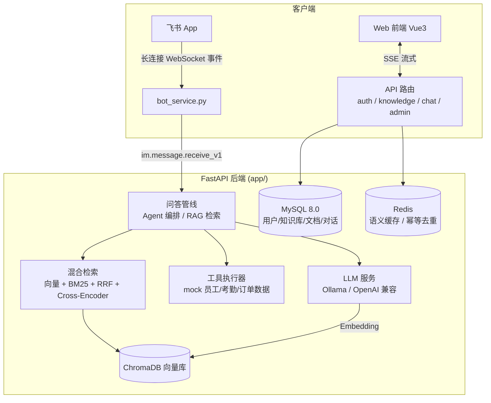

# 小苏 - 公司内部 AI 助手

基于 RAG（检索增强生成）+ Agent 工具调用的公司内部 AI 助手。员工上传公司文档建立知识库，通过 **Web 网页**或**飞书 IM** 向"小苏"提问：它基于知识库流式作答并附参考来源，知识库检索不到时会明确拒答而不编造；涉及员工信息 / 考勤 / 订单类问题时，它会自主调用内部数据工具查询后回答。

## 功能特性

- **多格式知识库**：PDF / Word / TXT / Markdown 上传解析，同名文件重复上传即增量替换（只保留最新版本）
- **RAG 问答**：混合检索（向量 + BM25）→ RRF 融合 → Cross-Encoder 精排，流式输出 + 参考来源引用（可点击查看原文片段）
- **拒答硬阈值**：精排后 top1 相关度低于阈值（默认 0.35）直接拒答，不调用 LLM、不编造
- **Agent 工具调用**：模型自主决定调用 `get_employee_info` / `get_attendance` / `get_orders` / `get_current_time` / `search_kb`，工具轨迹入库可查
- **多轮对话**：上下文记忆 + 语义缓存（Redis，命中即秒回）
- **多用户与组织**：JWT 登录，个人空间 / 组织空间，知识库按组织共享
- **飞书机器人**：长连接（WebSocket）接入，群聊 @ 与私聊均可，会话隔离 + 消息幂等去重
- **飞书身份绑定**：私聊中「绑定账号 + 密码验证」把飞书身份关联到 Web 账号，检索严格限定该账号可见的知识库范围（同名知识库不串库）
- **知识库绑定**：按群 / 按人 / 全局默认三级绑定知识库，管理后台可统一管理
- **Web 管理后台**：对话日志（含工具调用轨迹、token 用量）、LLM 模型切换、机器人连接状态心跳、知识库绑定管理

## 架构



## 界面截图

> 截图存放于 `docs/images/`，当前仓库不含截图文件（本地数据）。部署后自行截取并放入即可：

| 截图 | 说明 |
| --- | --- |
| `docs/images/chat.png` | Web 问答界面（流式回答 + 引用来源） |
| `docs/images/knowledge.png` | 知识库管理（上传文档 / 索引状态） |
| `docs/images/admin-logs.png` | 管理后台对话日志（含工具调用轨迹） |
| `docs/images/feishu.png` | 飞书私聊提问与绑定指令 |

## 技术栈

| 层 | 技术 |
| --- | --- |
| 后端 | FastAPI + SQLAlchemy 2.0（async + aiomysql）+ Pydantic v2（Python ≥ 3.12，uv 管理依赖） |
| 前端 | Vue 3 + Vite + Element Plus + Pinia（pnpm 管理依赖） |
| 检索 | ChromaDB 向量库 + rank-bm25 + Cross-Encoder 重排（RAGAS 评估） |
| LLM | Ollama（本地免费）或任意 OpenAI 兼容 API（MiniMax / DeepSeek / SiliconFlow / OpenAI） |
| IM | 飞书开放平台 + lark-oapi（WebSocket 长连接，无需公网回调） |
| 中间件 | MySQL 8.0（业务数据）+ Redis（语义缓存 / 幂等去重）+ ChromaDB（嵌入式，持久化于 `data/chroma_db`） |
| 部署 | Docker Compose 一键启动（前端 + 后端 + MySQL + Redis） |

## 快速开始

### Docker 一键启动（推荐）

```bash
git clone https://github.com/2179948316-boop/xiaosu-ai-assistant.git
cd xiaosu-ai-assistant
cp .env.example .env                    # 修改 MYSQL_ROOT_PASSWORD
cp backend/.env.example backend/.env    # 填入 LLM API Key / 数据库密码
docker compose up -d --build
```

启动后访问：

- 前端：http://localhost
- 后端 API 文档：http://localhost:8000/docs

### 本地开发（uv + pnpm）

依赖 [uv](https://docs.astral.sh/uv/) 与 [pnpm](https://pnpm.io/)，前后端各一条命令即可跑起来：

```bash
# 后端（端口 8000，虚拟环境固定为 .venv）
cd backend
uv venv .venv --python 3.12
uv sync
uv run uvicorn app.main:app --reload

# 前端（端口 5173）
cd frontend
pnpm install
pnpm dev
```

统一脚本：`./scripts/start.sh`（Docker 模式）/ `./scripts/start.sh dev`（本地模式）/ `./scripts/test.sh`（测试）。

## 使用指南

### 1. Web 端

1. 打开前端页面，注册账号并登录（管理员：`users.is_admin=1` 或在 `.env` 的 `ADMIN_USERNAMES` 白名单中加用户名）
2. 「知识库」页创建知识库 → 上传文档（PDF / Word / TXT / Markdown，同名重复上传即替换旧版本）→ 等待索引完成
3. 「对话」页提问，回答流式展示并附引用来源，可点击查看原文片段

### 2. 飞书机器人

**应用配置**（一次性）：

1. 飞书开放平台 [open.feishu.cn](https://open.feishu.cn) → 创建企业自建应用「小苏」→ 开通机器人能力
2. 权限管理添加：`im:message.group_at_msg:readonly`（接收群聊 @ 消息）、`im:message.p2p_msg:readonly`（接收私聊消息）、`im:message.send_as_bot`（以机器人身份发消息）、`im:resource`（读取消息中的图片等资源）
3. 事件订阅：添加事件 `im.message.receive_v1`，订阅方式选**长连接**（WebSocket，无需公网回调地址）
4. 把 `App ID` / `App Secret` 填入 `backend/.env` 的 `FEISHU_APP_ID` / `FEISHU_APP_SECRET`（`FEISHU_ENCRYPT_KEY` / `FEISHU_VERIFICATION_TOKEN` 长连接模式可留空）

**启动机器人**：

```bash
cd backend && uv run python bot_service.py
```

启动后日志出现 `connected to wss://msg-frontier.feishu.cn` 即接入成功。

**私聊指令**：

| 指令 | 说明 |
| --- | --- |
| `绑定账号：用户名` | 把当前飞书身份绑定到 Web 账号（随后回复该账号密码完成验证，密码仅本次使用、不落库） |
| `我的账号` / `当前账号` | 查看当前绑定的 Web 账号 |
| `我的知识库` | 列出当前账号可见的知识库（个人库 + 所在组织库） |
| `绑定知识库：名称或ID` | 绑定会话使用的知识库（重名时列出候选，按 ID 精确绑定） |
| `当前知识库` | 查看当前使用的知识库 |
| `解除绑定` | 解除飞书身份与 Web 账号的关联 |

> 安全说明：账号绑定仅限私聊；密码消息在指令层拦截，不写入任何日志与数据库；验证失败立即退出等待态。

**群聊**：群内 @ 小苏 提问即用；群的知识库绑定与私聊独立（群绑定优先于个人绑定）。

### 3. Web 管理后台

登录管理员账号后，侧边栏出现管理入口：对话日志（按用户/时间筛选、展开查看工具调用轨迹与 token 用量）、设置（切换 LLM 模型、查看机器人心跳状态）、知识库绑定（查看/新建/删除群与个人的绑定关系）。

## 测试

```bash
./scripts/test.sh   # cd backend && uv run pytest tests/ -v
```

180 条用例全部离线可跑（Mock LLM，不调真实 API），覆盖：

- Agent 编排（工具调用/降级/多轮记忆）与拒答硬阈值逻辑
- 文档增量更新（同名替换、向量清理）
- 飞书机器人（指令解析、账号绑定、知识库绑定、知识库范围检索）
- 管理后台权限与绑定接口
- RAG 管线组件（BM25 / Cross-Encoder / RRF / 文本切片 / 文件解析）
- RAGAS 评估适配（Ollama / OpenAI 双模式）

## Roadmap

已实现：Phase 1 知识库与 RAG → Phase 2 拒答硬阈值 / 增量更新 / 引用增强 → Phase 3 Agent 工具调用 → Phase 4 飞书机器人接入 → Phase 5 管理后台 + 飞书知识库/账号绑定。

规划中：工作流审批（报销/请假自动流转）、多模态文档（表格/图片 OCR 解析）、RAG 在线评估看板、飞书卡片交互（按钮确认工具操作）。

## 项目结构

```
xiaosu-ai-assistant/
├── backend/                 # FastAPI 后端（uv 管理）
│   ├── app/
│   │   ├── routers/         # API 路由（auth/knowledge/documents/chat/admin/organizations/mock_api）
│   │   ├── retrieval/       # RAG 检索管线（向量/BM25/RRF/Cross-Encoder/拒答）
│   │   ├── services/        # LLM、Embedding、Agent 编排、飞书机器人、文档、缓存
│   │   ├── models/          # SQLAlchemy 模型（用户/知识库/文档/对话/绑定关系）
│   │   └── utils/           # 文件解析、文本切片
│   ├── evaluation/          # RAGAS 评估（测试集生成/评估脚本/结果）
│   ├── bot_service.py       # 飞书机器人入口（长连接）
│   └── tests/               # pytest 测试（180 条，离线可跑）
├── frontend/                # Vue 3 前端（pnpm 管理）
├── scripts/                 # start.sh / test.sh / deploy.sh
├── docker-compose.yml       # 一键部署编排
└── init.sql                 # 数据库初始化
```

## 文档

- `AI_USAGE.md` — AI 使用说明（工具链、Prompt 案例、踩坑记录）
- `自评.md` — 项目自评（技术决策、妥协与改进方向）

## 许可

本项目仅用于学习与求职作品展示。
